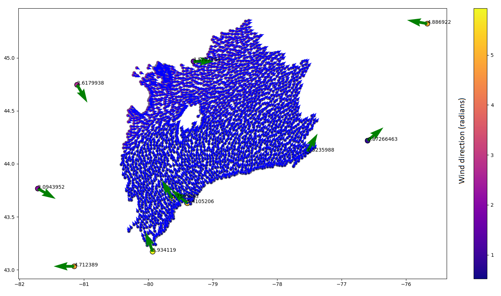

# 1. Hourly scalars to Hourly Basin
> preprocessMSCtoBasinsHourly.xml


1. Export hourly MSC .nc from FEWS, from 1989-10-01
1. Interpolate to 10km sub-watersheds, using a python script executed from FEWS (`ncScalarHoulyBasinNetCDF.py`)
    - Air temperature $(T)$, relative humidity $(r)$ and wind speeds $(u)$ are interpolated using a [linear radial basis function (RBF)](https://docs.scipy.org/doc/scipy/reference/generated/scipy.interpolate.Rbf.html).
    - Air/barometric pressure $(P)$ are first [corrected for elevation](https://owrc.github.io/interpolants/interpolation/barometry.html) then interpolated using the same linear RBF. 
    - Wind directions are split into their x-y components, each interpolated separately using a linear RBF before returned to an angle. A sample result is shown below:
    

1. Save to NetCDF (.nc) for import back to FEWS.


# 2. Hourly Basin to 6-hourly Basin
> preprocessMSCtoBasinsHourly.xml

Hourly aggregation to 6-hourly time intervals (00:00 06:00 12:00 18:00 UTC) is performed in FEWS using the [meanToMean aggregation](https://publicwiki.deltares.nl/display/FEWSDOC/Aggregation+MeanToMean) routine. 

These data have a set expiry.

Export 6-hourly, basin-interpolated $T, P, r, u$ to NetCDF (`export6hourlyBasinNC.xml`).


# 3. Daily scalars to Daily Basin
1. Export daily YCDB climate .nc from FEWS, from 1900-10-01 (`exportYCDBdailyNetcdf.xml`)
1. Interpolate to 10km sub-watersheds, using a python script executed from FEWS (`ncScalarToDailyBasinNetCDF.py`)
    - Min/max air temperature $(T_n/T_x)$ are interpolated using a [linear radial basis function (RBF)](https://docs.scipy.org/doc/scipy/reference/generated/scipy.interpolate.Rbf.html).
    - Rainfall $(R)$ and Snowfall $(S)$ interpolated to their nearest neighbour. 
1. Save to NetCDF (.nc) for import back to FEWS. 


# 4. Daily SNODAS to Basin
1. import SNODAS
1. interpolate to in 10km sub-watersheds FEWS using [InterpolationSpatialAverage](https://publicwiki.deltares.nl/display/FEWSDOC/InterpolationSpatialAverage) (`preprocessBasinSnowmelt.xml`)
3. export basin-interpolated SNODAS (`exportBasinNetcdfSNODASdaily.xml`)


# 5 Parse CaPA to rainfall/snowfall

1. ncgob.go


```python
import pandas as pd

pd.read.csv("")
```
