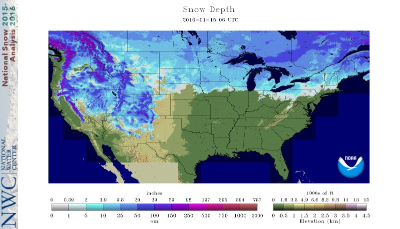

* TOC
{:toc}

# Introduction
The [ORMGP](https://maps.oakridgeswater.ca/) maintains a current, continuous daily climatology dataset beginning 1901. The data are interpolated to [some 3,000 ~10km² sub-watersheds](https://owrc.github.io/interpolants/interpolation/subwatershed.html) and are made available through our [web portal](https://maps.oakridgeswater.ca/Html5Viewer/index.html?viewer=ORMGPP). 

<iframe src="https://golang.oakridgeswater.ca/pages/swsmet.html" width="100%" height="400" scrolling="no" allowfullscreen></iframe>

*2,813 ~10km² sub-watersheds delineated within the ORMGP jurisdiction with their topological relationships defined. In addition to climate data, these sub-watersheds have aggregated land use characteristics.*
  

Currently, the data offered are:
- Rainfall
- Snowfall
- Snowmelt
- Minimum and Maximum temperatures
- Atmospheric pressure

The data serve many purposes from basic overlay with other disparate data sets (such as hydrographs) to providing input to hydrological and groundwater-integrated models. 

Clearly, data collection is constrained by public/private funding, open data sharing policies and technology; so the data served are a compilation of what is deemed the best for *our* needs and thus originate from a number of sources. Specifically, we are concerned about climatology at the *regional scale*. We cover a 3 Million hectare jurisdiction and based on our experience, compiling a continuous interpolated climate dataset requires greater emphasis on the spatial distribution of climatology over quality of data collected at climate stations.  That's not to say that this is a general rule, but for our needs in our humid region with a significant winter presence, attention to how weather distributes is of paramount importance.

Admittedly, greater emphasis is made to "re-packaging" data-products from external agencies; we are not trying to re-invent the wheel. Instead, we are only trying to automate a workflow that, until now, is constantly repeated by our partner agencies and partner consultants when such data are needed. We don't require any of our partners to use our data, we are only making available the data we use in our internal analyses.

Below is a description of the datasets used in our overall climatology package. Precipitation, for example, comes from a multitude of sources that generally follow technological advances. In order to obtain a century+ continuous dataset, older station-based interpolation is supplanted by more recent *"data assimilation systems"* (DAS), where and when available.

It's also worth noting that the density of [active meteorological stations present in our jurisdiction has been in decline since the 1970s](https://owrc.github.io/snapshots/gantt-met.html). Understandably, much of the recent investment in meteorological station operation has been dedicated to Canada's north, a large geographical region that has been grossly overlooked yet is most susceptible to a changing climate.

<!-- # Daily climatologies -->
Below, the data types that are collected, interpolated and delivered through our web portal are described in chronological order. For the most part, the most recent datasets supersede the oldest.

All interpolated (i.e., "vector") data are automatically updated and maintained using the [ORMGP-FEWS system](/interpolants/interpolation/fews.html). 

# Precipitation

## Meteorological Service of Canada
#### (*1901—present*)
Meteorological Service of Canada is a division of Environment Canada. Their [online historical data portal](https://climate.weather.gc.ca/index_e.html) provides data collected since the mid 19th century.

These data are collected at (point/local/scalar) weather stations and require spatial interpolation. Here, the nearest neighbour (i.e., Thiessen polygon) method is applied.

Precipitation is offered as rainfall and snowfall amounts to the tenth of a millimeter.

## Environment Canada Regional Deterministic Precipitation Analysis
<!-- #### (*2002—present, over a sequence of versions*) -->
The [Regional Deterministic Precipitation Analysis (RDPA)](https://weather.gc.ca/grib/grib2_RDPA_ps10km_e.html), which is based on the [Canadian Precipitation Analysis (CaPA) system](https://collaboration.cmc.ec.gc.ca/cmc/cmoi/product_guide/docs/lib/capa_information_leaflet_20141118_en.pdf), provides a country-wide field of 6-hourly precipitation accumulations. The CaPA-RDPA products has gone through a number of version changes since the turn of the century. The data are updated in near real-time, meaning that the current state of precipitation patterns can be made immediately available.

Simply put, CaPA-RDPA is an amalgamation of near-cast weather model predictions corrected by RADAR data and ground-truthed using a select set of weather stations. Essentially, CaPA-RDPA is a "[data assimilation](https://www.ecmwf.int/en/research/data-assimilation) system" (DAS) that provides users with the best-possible spatial distribution of precipitation, necessary for analyzing hydrology at the regional scale like the ORMGP jurisdiction.

While the CaPA-RDPA vector data fields can be acquired from Environment Canada in GRIB2 format, the ORMGP has sourced their data from the [Canadian Surface Prediction Archive (CaSPAr)](https://caspar-data.ca/), as their archive holds the original raw data (EC's GRIB2 format is re-interpolated to a polar-stereographic grid) and the CaSPAr platform allows users to crop their area of interest. 

### Data Corrections
The CaPA data are collected in their 6-hourly steps and are aggregated to daily accumulations. [(The 6-hourly fields are maintained for the sub-daily fields described here.)](/interpolants/interpolation/hourly.html) The precipitation fields are proportioned into rainfall and snowfall amounts based using an "optimized critical temperature" approach where precipitation fields are proportioned into rainfall and snowfall amounts based using the "critical temperature" $ (T_\text{crit}) $ approach:

$$
\text{Rainfall}=
\begin{cases}
\text{Precipitation}, & \overline{T}>T_\text{crit}\\
0 & \text{otherwise},
\end{cases}
$$

$$
\text{Snowfall}=
\begin{cases}
\text{Precipitation}, & \overline{T}\leq T_\text{crit}\\
0 & \text{otherwise}.
\end{cases}
$$

An optimization routine is employed to determine $ T_\text{crit} $ such that total snowfall converges with total snowmelt *independently for every winter season* to ensure minimal deviation from total precipitation. 

### Versions
Below lists the versions used, a complete [changelog can be found here](https://eccc-msc.github.io/open-data/msc-data/nwp_rdpa/changelog_rdpa_en/). The most recent version always takes precedence. 

#### CaPA-RDPA version 1—experimental (*2002—2012*)
The hind-cast "experimental" version 1 of CaPA-RDPA comes in a ~15km resolution.

#### CaPA-RDPA version version 2.4 (*2011—2016*)
Version 2.4 brings a number of improvements by incorporating more ground-truthing and refining to a ~10km resolution.

#### CaPA-RDPA version versions 4+ and 5+ (*2015—present*)
Further improvements, still at a ~10km resolution. 

#### CaPA-HRDPA (*2017—present*)
The latest iteration of CaPA is the [High Resolution Deterministic Precipitation Analysis (CaPA-HRDPA)](https://eccc-msc.github.io/open-data/msc-data/nwp_hrdpa/readme_hrdpa_en/) refined to a ~2.5km resolution.

### Missing Dates
The CaPA RDPA products used do have periods of no data. Listed below are the dates found. Where no data are found, the API reports the [data interpolated from point locations](https://owrc.github.io/interpolants/interpolation/daily.html#meteorological-service-of-canada).

#### CaPA-RDPA
- 2001-12-30
- 2001-12-31
- 2002-01-01
- 2006-04-27
- 2006-04-30
- 2006-07-10
- 2008-04-15
- 2019-09-26
- 2019-09-27
- 2019-10-25
- 2020-03-16
- 2020-03-17
- 2020-04-21
- 2020-04-22
- 2020-10-01
- 2020-10-02

#### CaPA-HRDPA
- 2019-12-14
- 2019-12-15
- 2019-12-16
- 2019-12-17
- 2021-01-01
- 2022-01-01
- 2022-06-20

### Missing Locations
At 2 locations, where the sub-watershed makes up the entirety of a small island, the Delft-FEWS interpolation scheme appears to overlook, and return a no-data value. When this occurres, the value given to nearby subwatersheds are adopted.

# Snowmelt
## SNODAS (*2010—present*)
Snow water equivalent (SWE) and snowmelt must be derived from snowpack ablation models. These models come in a variety of forms and sophistication. The primary source of such information comes from the [Snow Data Assimilation System (SNODAS)](https://nsidc.org/data/g02158) system (NOHRSC, 2004), which offers ~1km gridded 24-hour (UTC 06-06) snowmelt totals, published freely in near real-time. The advantage of SNODAS is that we can avoid the need to model snowmelt explicitly, and leverage existing resources. The data cover our jurisdiction from 2009—present.

## Cold Content Energy Balance Snowpack Model (*1901—present*)
When unavailable (and prior to 2010), a [cold content energy balance snowpack model](/interpolants/modelling/waterbudget/snowmeltCCF.html) is applied relying on interpolated precipitation and temperatures.

# Minimum and Maximum daily Temperature
Elevations within the ORMGP region range from 75-400 masl and thus orographic effects to temperatures were deemed negligible. The spatial distribution of minimum/maximum daily temperature is then interpolated from meteorological stations using an inverse squared-distance methodology.

## Meteorological Service of Canada (*1901—present*)
All temperature data are acquired from the Meteorological Service of Canada.

# Atmospheric Pressure
## Meteorological Service of Canada (*1953—present*)
Atmospheric pressure data are acquired from Meteorological Service of Canada, which come in as hourly averages. In contrast to temperatures, [elevation does have am impact on pressure distribution and thus corrections are made](/interpolants/interpolation/barometry.html). Once corrected, the hourly data are then aggregated to daily averages.

<!-- # Wind Speed and Direction -->

<!-- # Pan Evaporation -->

<!-- # Solar Irradiation -->

# References

National Operational Hydrologic Remote Sensing Center. 2004. Snow Data Assimilation System (SNODAS) Data Products at NSIDC, Version 1. [Indicate subset used]. Boulder, Colorado USA. NSIDC: National Snow and Ice Data Center. doi: https://doi.org/10.7265/N5TB14TC. [Date Accessed]