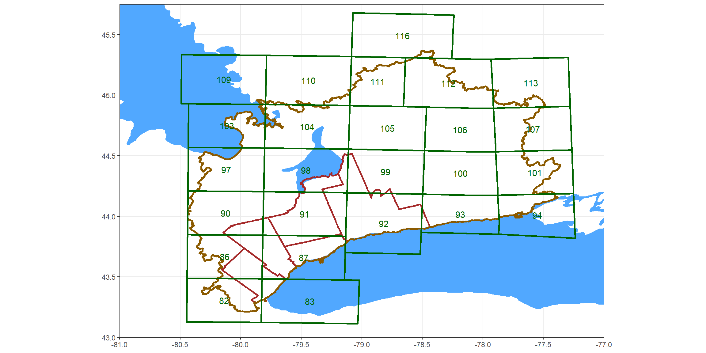
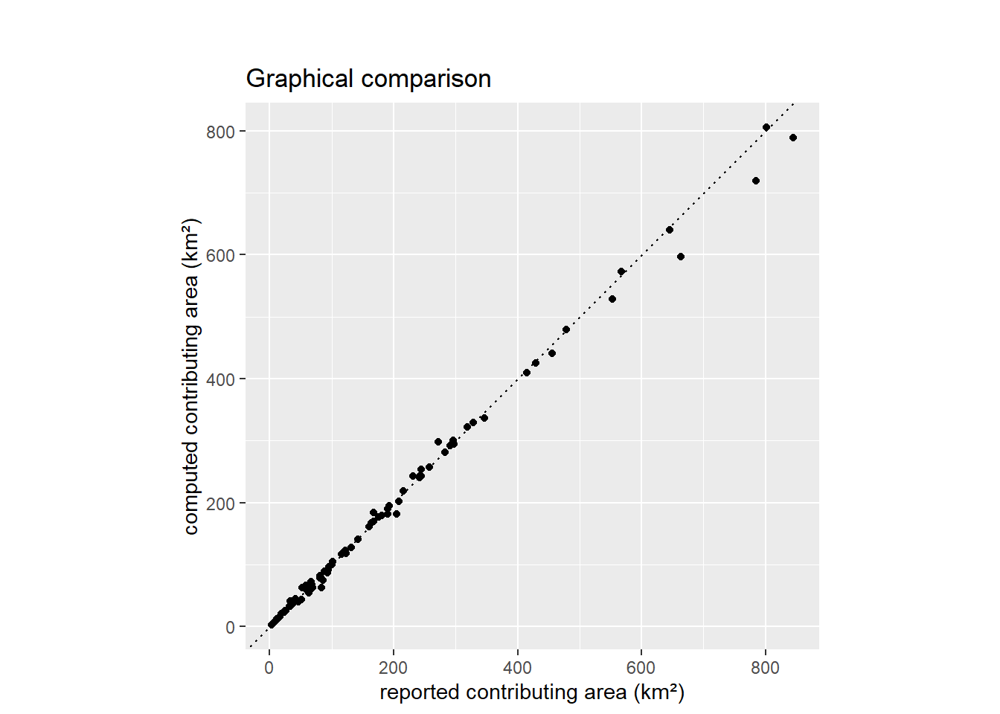

```{r setup, include=FALSE}
knitr::opts_chunk$set(echo = TRUE)
library(ggplot2)
library(geojsonio)
library(sf)
```

# Overland Drainage Model
* A so-called: "hydrologic correction" has been applied to a regional digital elevation model of our study area
* this has enabled:


## Digital Elevation Model
Ground surface elevations were collected from the 2006 version of the Provincial (Ministry of Natural Resources) Digital Elevation Model (DEM). This is a 10x10m² DEM derived from 1:10,000 scale OBM base mapping based on photogrammetic elevation points and 5m contours where the photogrammetic elevation points did not exist. An up-scaled 50x50m² Digital Elevation Model (DEM) is produced by merging the tiles shown below:


MNR 2006 Provincial DEM tiles shown in green.

<!-- 
BELOW CREATES THE dem-tiles.png
# ```{r fig.asp=0.50, fig.align="center", fig.width=12, message=FALSE, warning=FALSE, echo=FALSE, fig.cap="MNR 2006 Provincial DEM tiles shown in green."}

# spGL <- geojson_read("shp/greatLakes.geojson",  what="sp")
# spMNR <- geojson_read("shp/MNR_2006-tiles.geojson",  what="sp")
# spORMGP <- geojson_read("shp/ORMGP-region.geojson",  what="sp")
# spYPDTH <- geojson_read("shp/YPDTH.geojson",  what="sp")

# spMNR_points <- as.data.frame(do.call(rbind, lapply(spMNR@polygons, function(x) x@labpt))) # Convert nested list to data frame by column
# names(spMNR_points) <- c('long','lat')
# spMNR_points$num = spMNR$NUMBER

# ggplot() +
#     geom_polygon(data=spGL, aes(x=long, y=lat, group=group), fill="#51a8ff", color="#51a8ff") +
#     geom_polygon(data=spYPDTH, aes(x=long, y=lat, group=group), fill=NA, color="brown", size=1) +
#     geom_polygon(data=spORMGP, aes(x=long, y=lat, group=group), fill=NA, color="orange4", size=1) +
#     geom_polygon(data=spMNR, aes(x=long, y=lat, group=group), fill=NA, color="darkgreen",size=1) +

#     geom_text(data=spMNR_points, aes(x=long, y=lat, label=num), color="darkgreen") +

#     theme_bw() + theme(axis.title = element_blank(),
#                        title = element_blank(),
#                        legend.box.spacing = unit(0, "mm")) +
#                        # plot.background=element_rect(fill="red")) +
#     #labs(x='longitude',y='latitude', title="MNR 2006 Provincial DEM tiles shown in green.") +
#     coord_sf(xlim=c(-81, -77), ylim=c(43, 45.75), expand=FALSE)
# ```
-->


Elevation data were up-scaled by taking the average of known elevations occurring within every 50x50m² cell. The resulting grid is a 5000x5000 50m-uniform cell grid, with an upper-left-corner origin at (E: 545,000, N: 5,035,000) NAD83 UTM zone 17.


## Hydrological "correction" {#hyd.corr}

An automated topological topological analysis is performed on the DEM using the following methodologies:

1. Automated depression filling (Wang and Liu, 2006) was applied to the DEM. This filtering of elevation data ensures that every grid cell has at least 1 neighbouring cell with an assigned elevation at or below the current cell's elevation. This ensures that "drainage" is never impeded.
2. While the above code works for most of the area, it will leave flat (zero-gradient) regions especially around lakes and wetlands. A fix by Garbrecht and Martz (1997) was added to ensure a consistent flow direction with negligible change to the corrected DEM.
3. Flow paths are then computed based on the "D8" algorithm (O'Callaghan and Mark, 1984).

Cell slopes and aspects are computed using a 9-point planar regression from the cell's elevation plus its 8 neighbouring elevations.

## Manual adjustments

While automated hydrological correction is quite powerful when applied to the Provincial DEM, there are in rare places where the algorithm fails to capture mapped flow paths (usually in flatter rural regions close to embanked roads). Fortunately, these errors can be easily corrected by imposing flow directions using hand-drawn flow paths. Flow paths are save as polylines, where its vertices are ordered according to flow direction. 

With the current version (v.2020), 10 flow corrections have been imposed and are saved in a set of shapefiles.  There is at the moment 1 new flow path correction in queue and will be imposed for the next release. *This is to say that this layer and its derivatives are continually being updated.*


## Validation


The ORMGP regional 50x50m² Hydrologically corrected Digital Elevation Model (HDEM, v.2020)

The benefit of computing the flow direction topology associated with the HDEM is that any user a could place a "virtual particle" on the landscape and follow its drainage path as it traverses toward its terminus; in this case, the Great Lakes.

More importantly however, given an HDEM, one can also efficiently compute the contributing area to any selected point on the landscape. (A live demonstration of this is presented below.) This feature provides the means to validate the processing presented in this document.

Locations of 96 current and historical stream flow gauges are used to compare drainage areas reported to the drainage areas computed using the HDEM. Sources of the station locations were collected from the Water Survey of Canada and the Toronto Region Conservation Authority. The table below lists the stations used, followed by a figure comparing their match to the HDEM. As mentioned earlier, this layer will continually be updated with input from users and it is expected that this validation can only improve.




<!-- BELOW CREATS graphical-comparison.png
<br></br>
<center>List of streamflow gauging stations with reported contributing area.
# ```{r message=FALSE, warning=FALSE, echo=FALSE}
# library(knitr)
# library(dplyr)
# library(kableExtra)
# library(rgdal)
# library(ggplot2)
# options(knitr.kable.NA = '')

# df <- read.csv('shp/t2-check.csv') 

# sputm <- SpatialPoints(cbind(df$E,df$N), proj4string=CRS("+proj=utm +zone=17 +datum=WGS84")) 
# spgeo <- spTransform(sputm, CRS("+proj=longlat +datum=WGS84"))
# lnlt <- coordinates(spgeo) # https://stackoverflow.com/questions/30018098/how-to-convert-utm-coordinates-to-lat-and-long-in-r

# df %>%
#   mutate(DAdb=DAdb/1000/1000,DAcalc=DAcalc/1000/1000,Long=lnlt[,1],Lat=lnlt[,2]) %>%
#   select(2,6:9) %>%
#   relocate(LOC_NAME,Long,Lat,DAdb,DAcalc) %>%
#   mutate(diff=(DAcalc-DAdb)/DAdb*100) %>%
#   arrange(LOC_NAME) %>%
#   kbl(
#     col.names = c("Station ID", "Long", "Lat", "reported (km²)", "computed (km²)", "*difference* (%)"),
#     align = c("l","r","r","r","r","r"),
#     digits = 1
#   ) %>%
#   kable_styling(bootstrap_options = c("striped", "hover", "condensed")) %>%
#   add_header_above(c(" " = 3, "Contributing Area" = 3), align = "c") %>%
#   kableExtra::scroll_box(width = "90%", height = "300px")


# df %>% ggplot(aes(DAdb/1000/1000,DAcalc/1000/1000)) +
#   geom_point() +
#   geom_abline(linetype="dotted") +
#   labs(title="\n\nGraphical comparison",x="reported contributing area (km²)",y="computed contributing area (km²)") +
#   coord_fixed()
# ```
</center>
-->


## Contributing area delineation

One (of many) APIs (application programming interfaces) hosted by the ORMGP leverages the drainage topology computed in the area. Now, users have the ability to have returned a delineated catchment area polygon for any given point that lies within the HDEM extent. Try below:

```{r, echo=FALSE, message=FALSE, warning=FALSE, out.height='600px', out.width='100%', fig.cap="ORMGP v.2020 HDEM. Click anywhere (within our jurisdiction) to return its contributing area. *Hint: best to click along a watercourse*"}
knitr::include_app("https://owrc.shinyapps.io/CAdemo/", height = "600px")
```

# References

Garbrecht Martz 1997 The assignment of drainage direction over flat surfaces in raster digital elevation models

O'Callaghan, J.F., and D.M. Mark, 1984. The extraction of drainage net-works from digital elevation data, Comput. Vision Graphics Image Process., 28, pp. 328-344

Wang, L., H. Liu, 2006. An efficient method for identifying and filling surface depressions in digital elevation models for hydrologic analysis and modelling. International Journal of Geographical Information Science 20(2): 193-213.

