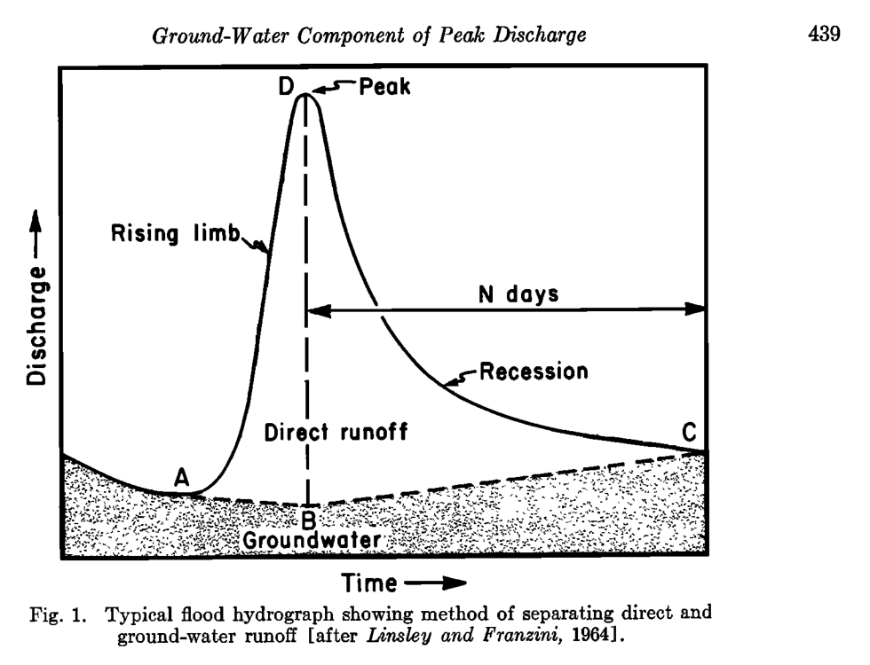

* TOC
{:toc}

# Automated Hydrograph Separation

> "Division of a hydrograph into direct and groundwater runoff as a basis for subsequent analysis is known as *hydrograph separation* or *hydrograph analysis*. Since there is no real basis for distinguishing between direct and groundwater flow in a stream at any instant, and since definitions of these two components are relatively arbitrary, the method of separation is usually equally arbitrary." - Linsley et.al., 1975

## The Idea

For hydrograph separation, it is generally assumed that total flow ($q$) at any particular time ($t$) of a streamflow hydrograph can be partitioned into two primary components:

1. The *__slow flow__* component $(b)$, which is itself composed of the gradual release of water from watershed stores in addition to groundwater discharging into streams, the "groundwater runoff" in Linsley etal.). The slow flow component has been commonly referred as "baseflow." and,
1. The *__quick flow__* component ($f$), which originates from rainfall and/or snow melt events (i.e., "direct runoff" in Linsley et.al., 1975).

Together, the slow and quick flow components sum to total flow: $q=b+f$. Conceptually, after a period of time following a precipitation event, streamflow continues to decrease at a predictable rate as it is composed entirely of slowflow ($f=0$). Upon the onset of a heavy rain event, the hydrograph quickly rises, as quick flow is added to the slowflow signature. One could imagine that should this rain event never occur, the underlying slowflow would have continued uninterrupted (such as in Reed et.al., 1975). The difference between total flow and this "underlying" slowflow is perceived as quickflow.

## The Need

Hydrologists found the need to separate the hydrograph into its constitutive components as it was found that runoff created from a precipitation event (i.e., rainfall and/or snow melt) tended to correlate best with the quickflow component only, as opposed to the total flow hydrograph (Beven, 2012). Consequently, a number of automatic hydrograph separation routines were proposed, all being "equally arbitrary" (Linsley et.al., 1975).

For many groundwater flow models in southern Ontario, it is assumed that the long-term rate of slowflow is predominantly groundwater discharge. Therefore, long-term average rates of slowflow serve as an important constraint to groundwater flow models.

## Slowflow Quantification

In general, two metrics can be determined from hydrograph separation that need definition. 

### Baseflow Index

The first is the baseflow index ($BFI$), which is the ratio of long term baseflow discharge to total discharge:

$$\text{BFI}=\frac{\sum b}{\sum q}$$

### Recession Coefficient $(k)$

The second is the slowflow recession coefficient $(k)$, which describes the withdrawal of water from storage within the watershed (Linsley et.al., 1975). The recession coefficient is a means of determining the amount the rate of slowflow recedes after a given period of time, and is reasonably simulated by an exponential decay function:

$$b_t=kb_{t-1},$$

where $b_{t-1}$ represents the slow flow calculated at one timestep prior to $b_t$. *(Implied here is that flow measurements are reported at equal time intervals.)*

### Quickflow Cessation Time $(N)$

Linsley et.al. (1975) also offered an approximate means of determining the time (in days) after peak flow discharge to when quickflow ceases $(f\to0)$, making total flow entirely composed of the slowflow component, whose behaviour can be predicted by the recession coefficient. As a "rule of thumb" (Linsley et.al., 1975) the number of days $(N)$ when quick flow terminates is approximated by:

$$N=0.827A^{0.2},$$

where $A$ is the watershed area (km²). 

The above empirical relation is included here as many automatic hydrograph separation algorithms discussed below utilize this approximation. Hydrograph components and "quickflow cessation" $(N)$ is implicitly conceptualized when performing automatic hydrograph separation routines.

<!--  -->

> *Note for reference to the image above: "direct runoff" = quickflow, and "ground-water runoff" = slowflow.* 

# Algorithms

## Digital Filters

Digital filters represent a set of automatic hydrograph separation algorithms that require no input other than the measured stream flow signal $(q)$. Considering the streamflow hydrograph as a signal is quite apt when dealing with digital filters, as they themselves were inspired from signal processing of Lyne and Hollick, 1979 (Nathan and McMahon, 1990). With respect to the quick and slow hydrograph components (Figure \ref{fig:conceptual_hydrograph}), hydrograph separation is nothing more than the application of a low-pass filter to the total streamflow signal.

Another point to note is that many authors have applied these digital filters in multiple passes, either in two-passes (forward $\to$ backward) or three-passes (forward $\to$ backward $\to$ forward) to increase the smoothing of the resulting slow flow signal (Chapman, 1991).

### The General Form

With digital filters, there is no physical interpretation to the algorithm, it only produces a baseflow signal that resembles what one would expect. The general form of all digital filters used for hydrograph separation follows:

$$b_t = \alpha b_{t-1} + \beta\left(q_t + \gamma q_{t-1}\right),$$

where $q_{t-1}$ represents the total flow measured at one timestep prior to $q_t$, and $\alpha$, $\beta$ and $\gamma$ are parameters. The above equation is a three-parameter equation, however most implementations do not require every parameter be specified or, in other cases, two or more parameters can be specified as a function of another.

### Lyne and Hollick (1979)

For example, the Lyne and Hollick (1979) equation (the earliest of digital filters used for hydrograph separation), is a one-parameter equation found by a single smoothing parameter $a$ suggested to be set between the values of 0.9--0.95 (Nathan and McMahon, 1990), where:

$$\alpha = a \qquad \beta = \frac{1-a}{2} \qquad \gamma=1.0$$

### Chapman (1991)

After noting some conceptual discrepancies with the Lyne and Hollick (1979) equation, Chapman (1991) modified the equation into a parameter-less form as a function of the recession coefficient $k$, discussed above. The Chapman (1991) algorithm takes the form:

$$\alpha = \frac{3k-1}{3-k} \qquad \beta = \frac{1-k}{3-k} \qquad \gamma=1.0$$

### Chapman and Maxwell (1996)

Chapman and Maxwell (1996) later simplified the above equation by assuming that slow flow is the weighted average of quick flow and the slow flow from the previous timestep (Chapman, 1999), that is $b_t=kb_{t-1}+(1-k)f_t$, leading to:

$$\alpha = \frac{k}{2-k} \qquad \beta = \frac{1-k}{2-k} \qquad \gamma=0.0$$

### Boughton (1993) & Eckhardt (2005)

Boughton (1993) used a similar approach to Chapman and Maxwell (1996), except added an adjustment parameter $C$, such that $b_t=kb_{t-1}+Cf_t$. The Boughton (1993) form of the digital filter thus requires:

$$\alpha = \frac{k}{1+C} \qquad \beta = \frac{C}{1+C} \qquad \gamma=0.0$$

While also investigating the generalized digital filter, Eckhardt (2005) discovered an interpretation of the Boughton (1993) algorithm that eliminated the $C$ parameter and introduced the concept of $\text{BFI}_\text{max}$: the maximum value of the baseflow index that can be achieved using the digital filter. The Eckhardt (2005) digital filter is found by:

$$\alpha = \frac{(1-\text{BFI}_\text{max})k}{1-k\text{BFI}_\text{max}} \qquad \beta = \frac{(1-k)\text{BFI}_\text{max}}{1-k\text{BFI}_\text{max}} \qquad \gamma=0.0$$

or made equivalent to Boughton (1993) by setting:

$$C = \frac{(1-k)\text{BFI}_\text{max}}{1-\text{BFI}_\text{max}}$$	

Eckhardt (2005) suggests estimates for $\text{BFI}_\text{max}=0.8$ for perennial streams; $0.5$ for ephemeral streams; and $0.25$ for perennial stream over hard-rock aquifers.

### Jakeman and Hornberger (1993)

The Jakeman and Hornberger (1993) algorithm closely follows that of Boughton (1993) and Chapman and Maxwell (1996), except it was formulated from a component of the IHACRES data-based model rather than being intended strictly for hydrograph separation (Chapman, 1999). Nonetheless, the IHACRES model can be shown to fit the general digital filter of equation above, using 3 parameters, where:

$$\alpha = \frac{a}{1+C} \qquad \beta = \frac{C}{1+C} \qquad \gamma=\beta\alpha_s$$

> Note that setting $\alpha_s<0$ is conceptually correct, as it implies that the rate of change of slow flow is positively correlated the rate of change of total flow (Chapman, 1999). Suggested value for $\alpha_s=-exp(-1/k)$.

### Tularam and Ilahee (2008)

Lastly, Tularam and Ilahee (2008) most recently presented an digital filter that also resembled that of Chapman and Maxwell (1996), with the slight difference of assuming that slow flow is the weighted average of the slow flow of the previous timestep and total flow, not quick flow (i.e., $b_t=ab_{t-1}+(1-a)q_t$). This formulation is essentially the same as Lyne and Hollick (1979) with the exception that Tularam and Ilahee (2008) does not average total flow of the current and previous timestep. The one-parameter Tularam and Ilahee (2008) form yields:

$$\alpha = a \qquad \beta = 1-a \qquad \gamma=0.0$$

### Digital filter equations in their published form

Lyne and Hollick (1979):

$$b_t = ab_{t-1} + \frac{1-a}{2}\left(q_t + q_{t-1}\right)$$

Chapman (1991):

$$b_t = \frac{3k-1}{3-k}b_{t-1} + \frac{1-k}{3-k}\left(q_t + q_{t-1}\right)$$

Chapman and Maxwell (1996):

$$b_t = \frac{k}{2-k}b_{t-1} + \frac{1-k}{2-k}q_t$$

Boughton (1993):

$$b_t = \frac{k}{1+C}b_{t-1} + \frac{C}{1+C}q_t$$
	
Eckhardt (2005):

$$b_t = \frac{(1-\text{BFI}_\text{max})kb_{t-1} + (1-k)\text{BFI}_\text{max}q_t}{1-k\text{BFI}_\text{max}}$$
	
Jakeman and Hornberger (1993):

$$b_t = \frac{a}{1+C}b_{t-1} + \frac{C}{1+C}\left(q_t + \alpha_s q_{t-1}\right)$$	

Tularam and Ilahee (2008):

$$b_t=ab_{t-1}+(1-a)q_t$$	

## Moving-window methods

A second class of hydrograph separation schemes are here considered "moving window methods" also known as "manual separation techniques" in Arnold and Allen (1999). These methods do not follow an equation, per se, rather a methodology based on the explicit/manual selection of discharge values assumed representative of slowflow discharge within a window of a set number of days.

In total, 10 estimates of slowflow discharge are computed using variants of 4 methods. Many of these methods are included in stand-alone software packages and have been re-coded here. The methods include:

### UKIH (3)
The UKIH/Wallingford (Institute of Hydrology, 1980) method operates by locating minimum discharges in a (user specified) $N$-day window. This set of minimum discharge is then further screened, automatically, for discharges that are considered representative of "baseflow," which are deemed "turning points." Linear interpolation is then conducted between subsequent turning points yielding the final slowflow discharge. In a similar fashion to the digital filters, this method extracts a filtered/smoothed hydrograph of total flow minima, and is therefore often also referred to as the "smoothed minima technique." 
	
Piggott et.al. (2005) discussed how the UKIH technique can yield alternate baseflow estimates depending on the origin of the $N$-day window. They proposed staggering $N$-sets of UHIK baseflow estimates to create an overall aggregate baseflow hydrograph. Three versions of this modification are included here:
	
1. Sweeping minimum: returns the daily minimum of the staggered hydrographs;
1. Sweeping maximum: returns the daily maximum of the staggered hydrographs; and,
1. Sweeping median:  returns the median of the $N$-staggered hydrographs.
	
### HYSEP (3)
The HYSEP technique (Sloto and Crouse, 1996). This method depends on the computed days of quick flow termination $N$. Like the UKIH method, the HYSEP techniques then proceed to determine minimum discharges within the $N$-day window. Three methods of producing baseflow estimates are computed in HYSEP and are reproduced here, they include:
	
1. Fixed interval: where baseflow is assumed to be the minimum discharge reported within sequential, non-overlapping $N$-day windows. Like the UKIH method, results from the fixed interval method is dependent on the ("fixed") window origin;
1. Sliding interval: where baseflow is assumed to be the minimum discharge found within a moving $N$-day window. In contrast, this method tends to yield a higher BFI; and,
1. Local minimum: linearly-interpolates total flow minima within a moving $N$-day window.
	
### PART (3)
The PART technique (Rutledge, 1998). This method aims to reproduce the conceptual hydrograph represented in the Figures above. Using a combination of quick flow termination estimates $(N)$, recession coefficients $(k)$, and a parameter termed the "antecedent requirement," a combination of forward and backward filtering techniques are used in producing the final hydrograph separation estimates. Three estimates using the PART method are produced here, based on the suggested antecedent requirement choices offered by Rutledge (1998):
	
1. $\text{antecedent requirement} = 1$;
1. $\text{antecedent requirement} = 2$; and, 
1. $\text{antecedent requirement} = 3$.
	

### Clarifica
The Clarifica Inc., (2002) technique. This method separates the total flow hydrograph by performing two sweeps on the hydrograph. The first is a 6-day moving minimum, followed by a 5-day moving average (3-days previous, 1-day ahead). This method was designed for use within southern Ontario watersheds and tends to produce higher estimates of baseflow during peak flow events.
	
## Physically-based digital filters
Another class of hydrograph separation routines are those deemed "physically-based" (Furey and Gupta, 2001). These methods of separation allow for additional input, such as climate conditions, to help guide the separation of the hydrograph; contrast this to the above methods where only parameters need tuning until the desired ("arbitrary") slowflow signal is produced.

Furey and Gupta (2001) presented a digital filter that was formulated this way. At the moment, physically-based digital filters have not been applied.

# Source code
The above algorithms are available using the following jupyter script, some edits may be required to accommodate data format. In its current state, it readily reads a hydrograph .csv file with the header: `"Date,Flow,Flag"`.

# References

Boughton, W.C., 1993. A hydrograph-based model for estimating the water yield of ungauged catchments. Hydrology and Water Resources Symposium, Institution of Engineers Australia, Newcastle: 317-324.

Chapman, T.G. and A.I. Maxwell, 1996. Baseflow separation - comparison of numerical methods with tracer experiments.Institute Engineers Australia National Conference. Publ. 96/05, 539-545.

Chapman T.G., 1999. A comparison of algorithms for stream flow recession and baseflow separation. Hydrological Processes 13: 710-714.

Clarifica Inc., 2002. Water Budget in Urbanizing Watersheds: Duffins Creek Watershed. Report prepared for the Toronto and Region Conservation Authority.

Eckhardt, K., 2005. How to construct recursive digital filters for baseflow separation. Hydrological Processes 19, 507-515.

Furey, PR. and VK Gupta. 2001. A physically based filter for separating base flow from streamflow records. Water Resources Research, 37(11): 2709-2722.

Institute of Hydrology, 1980. Low Flow Studies report. Wallingford, UK.

Jakeman, A.J. and Hornberger G.M., 1993. How much complexity is warranted in a rainfall-runoff model? Water Resources Research 29: 2637-2649.

Lyne, V. and M. Hollick, 1979. Stochastic time-variable rainfall-runoff modelling. Hydrology and Water Resources Symposium, Institution of Engineers Australia, Perth: 89-92.

Piggott, A.R., S. Moin, C. Southam, 2005. A revised approach to the UKIH method for the calculation of baseflow. Hydrological Sciences Journal 50(5): 911-920.

Reed, D.W., P. Johnson, J.M. Firth, 1975. A Non-Linear Rainfall-Runoff Model, Providing for Variable Lag Time. Journal of Hydrology 25: 295–305.

Rutledge, A.T., 1998. Computer Programs for Describing the Recession of Ground-Water Discharge and for Estimating Mean Ground-Water Recharge and Discharge from Streamflow Records-Update, Water-Resources Investigation Report 98-4148.

Sloto, R.A. and M.Y. Crouse, 1996. HYSEP: A Computer Program for Streamflow Hydrograph Separation and Analysis U.S. Geological Survey Water-Resources Investigations Report 96-4040.

Tularam, A.G., Ilahee, M., 2008. Exponential Smoothing Method of Base Flow Separation and its Impact on Continuous Loss Estimates. American Journal of Environmental Sciences 4(2):136-144.